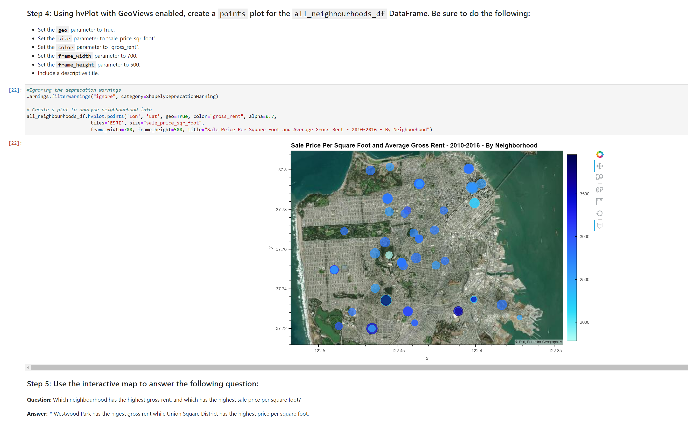

# Proptech

## Notes 

Map is correctly showing in the local Jupytor Lap. However, it does not shows in the Github repository after uploaded it. I think this might be related to some limitations in the Github. 

Furthermore, it is also possible to load the map using the same code in vscode too. I added some a screenshot of this too. 

### Loading map in Jupytor Lab

### The following screenshot shows the loading map in the vs code too. 

